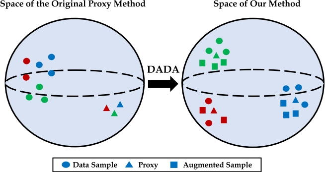

# Implementation of Data-Augmented Domain Adaptation for Deep Metric Learning (AAAI 2024)
Ren, Li and Chen, Chen and Wang, Liqiang and Hua, Kien

## Abstract
Deep Metric Learning (DML) plays an important role in modern computer vision research, where we learn a distance metric for a set of image representations. Recent DML techniques utilize the proxy to interact with the corresponding image samples in the embedding space. However, existing proxy-based DML methods focus on learning individual proxy-to-sample distance while the overall distribution of samples and proxies lacks attention. In this paper, we present a novel proxy-based DML framework that focuses on aligning the sample and proxy distributions to improve the efficiency of proxy-based DML losses. Specifically, we propose the Data-Augmented Domain Adaptation (DADA) method to adapt the domain gap between the group of samples and proxies. To the best of our knowledge, we are the first to leverage domain adaptation to boost the performance of proxy-based DML.We show that our method can be easily plugged into existing proxy-based DML losses. Our experiments on benchmarks, including the popular CUB-200-2011, CARS196, Stanford Online Products, and In-Shop Clothes Retrieval, show that our learning algorithm significantly improves the existing proxy losses and achieves superior results compared to the existing methods.

## Demo Figure



## Citation
If you find this repo useful, please consider citing:

```Bibtex 
@inproceedings{ren2024towards,
  title = {Towards improved proxy-based deep metric learning via data-augmented domain adaptation},
  author = {Ren, Li and Chen, Chen and Wang, Liqiang and Hua, Kien},
  booktitle = {Proceedings of the 38th AAAI Conference on Artificial Intelligence},
  year = {2024}
}
```

## Installation

1. Properly install the [Anaconda](https://www.anaconda.com/download) or [Miniconda](https://repo.anaconda.com/miniconda/)
2. Prepare Conda enviroment with following script
  
```Bash
conda init
source ~/.bashrc
conda create --name dml python=3.8 -y
conda activate dml
```
3. Install CUDA and Pytorch with following script
   
```Bash
conda update -n base -c defaults conda -y
conda install -y scipy pandas termcolor
conda install -yc conda-forge
conda install -y pytorch=1.12.1=py3.8_cuda11.3_cudnn8.3.2_0 torchvision faiss-gpu cudatoolkit=11.3 -c pytorch
pip install timm tqdm pretrainedmodels
```


## Download Data
**CUB200** can be downloaded from [here](https://www.dropbox.com/s/tjhf7fbxw5f9u0q/cub200.tar?dl=1) \
**CARS** can be downloaded from [here](https://www.dropbox.com/s/zi2o92hzqekbmef/cars196.tar?dl=1) \
**Stanford_Online_Products** can be downloaded from the [official webset](https://cvgl.stanford.edu/projects/lifted_struct/)\
**In-Shop Clothes Retrieval** can be downloaded from the [official webset](https://mmlab.ie.cuhk.edu.hk/projects/DeepFashion/InShopRetrieval.html)

The datasets should be unpacked and placed in a distinct folder. An illustration of a data structure is as follows:

```Bash 
$HOME/data/
├── cars196
│   └── images
├── cub200
│   └── images
├── inshop
│   └── img
|   └── list_eval_partition.txt
├── online_products
│   ├── images
│   └── Info_Files

```


## Training

Start to run the training procedure with following command:

```Bash
python main.py --source_path {data_path} \
--save_path {save_path} \
--save_name {save_name} \
--config {config_path} \
--gpu {gpu_id}
```

**`{data_path}`** is the root of your dataset.\
**`{save_path}`** is the path to save essential data and checkpoints.\
**`{save_name}`** is the name of this config_pathrun
**`{config_path}`** is the path of configure file that save specific hyper-parameters.\
**`{gpu_id}`** is the index of your GPU starting from 0

For example, to train a model from CUB200 on GPU 0

```Bash
# Train DADA on CUB200
python main.py --source_path ../dml_data \
--save_path ../Results \
--config ./configs/cub200.yaml \
--gpu 0
```

You can also create your own training config by editing or creating files in ./configs/{your_setting}.yaml

## Evaluation

To evaluate the pre-trained model, run following script:

```Bash
python eval.py --source_path {data_path} \
--dataset {data_name} \
--test_path {checkpoint_path} \
--evaluation_metrics {metrics}
```

**`{data_path}`** is the root of your dataset.\
**`{data_name}`** is the name of dataset (cub200, cars196, online_products, inshop).\
**`{checkpoint_path}`** is the path of your pre-trained checkpoint \
**`{metrics}`** is the list of evaluation metrics

For example,
```Bash
# evaluate one checkpoint on CUB200
python eval.py --source_path ../dml_data \
--dataset cub200 \
--test_path ../Results/cub200/checkpoint_cub_embeds_e_recall@1.pth.tar \
--evaluation_metrics ['e_recall@1', 'e_recall@2', 'e_recall@4', 'e_recall@10', 'f1', 'mAP_R']
```

The pre-trained model to demo the evaluation on CUB200 can be downloaded [here](https://www.dropbox.com/scl/fi/5hb18sjxesm3oe2pu7jaq/checkpoint_cub_embeds_e_recall-1.pth.tar?rlkey=4smw52dsuoej5zpiywmawc35d&dl=0)

Please note that the reproduced results may be different from the those reported in the paper due to different enviroments and the architecture of GPUs. Our original experiments were done on RTX3090 with Cuda 11.3 and Pytorch 1.12


## Acknowledgement

This implementation is partially based on:

https://github.com/Confusezius/Deep-Metric-Learning-Baselines
https://github.com/Confusezius/Revisiting_Deep_Metric_Learning_PyTorch
